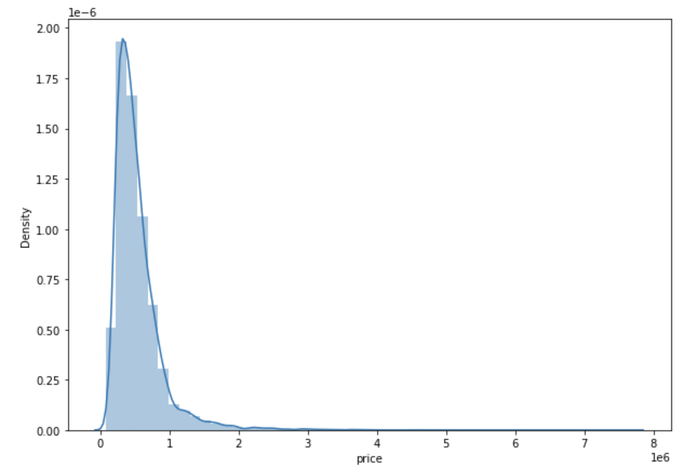
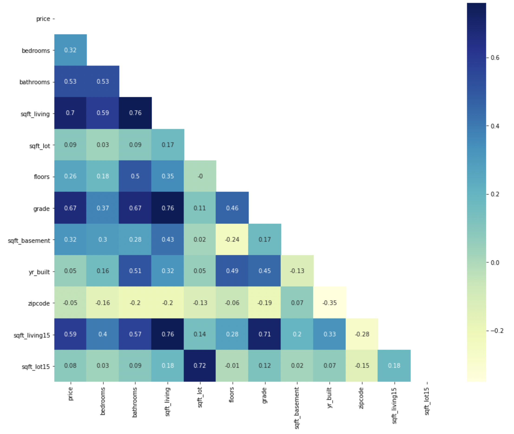
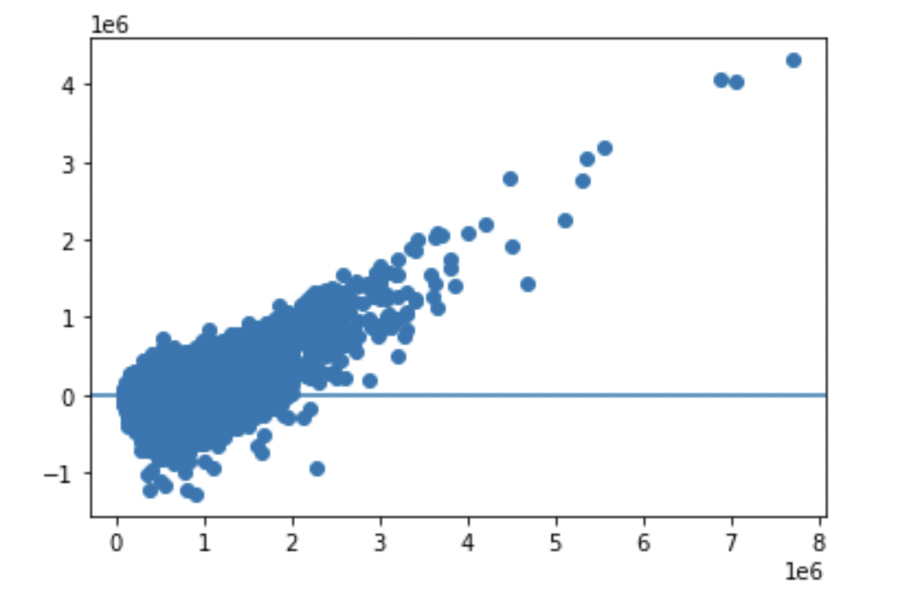
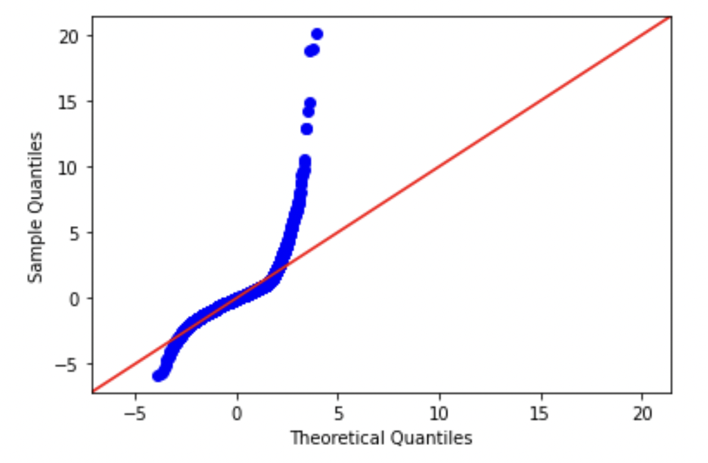
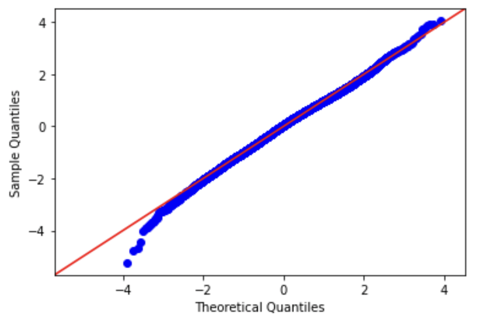
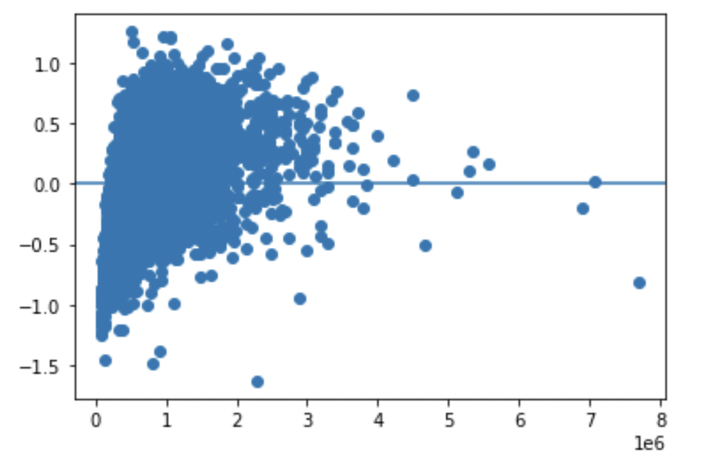

# Phase 2 Project : King County House Data Analysis

Author: Kregg Jackson

## Project Overview

For this project I used multiple linear regression modeling to analyze house sales in King County.

## Business Problem

King County house renovators want to know what features have the strongest effect on sale. This project is designed to assist King County renovators by finding which elements of a house have the greatest impace on sale price.

## The Data

This project uses the King County House Sales dataset, which can be found in `kc_house_data.csv` in the data folder in this assignment's GitHub repository. The description of the column names can be found in `column_names.md` in the same folder.

## Methods

I used multiple linear regression after testing and cleaning the data. The cleaning process consisted of formatting columns so the model can read the data and dropping predictors that are too correlated. I buit a model with the `price` column as the dependent variable and the highest correlated predictor `sqft_living` then I used a Q-Q plot graph and a scatter plot graph to see if the data in the relationship was distributed normally. After I built a model out of the full cleaned data frame and got a high R-squared but the graphs showed the data still wasn't normally distributed. I built abither model with and replaced the `price` dependent variable with a log of the `price` column and that finally made the data distribute normally.

## Results

### Baseline Model

The baseline model’s high R squared and low p -value showed that there is a relationship between `price` and `sqft_living`. However this model is inconclusive because there is not enough data and sqft_living is too highly correlated with the other predictors  

### First Model

The first model has a high R-squared of 0.891 and low p-values on most of the predictors. This model is also fairly inconclusive because the model's scatter plot is too heteroscedastic and the Q-Q plot shows that the data is still not normally distributed.

### Final Model

On the final model the R-squared score dropped to 0.650 but almost all the predictors have a low p-value. The Q-Q plot shows the model is normally distributed and the scatter plot shows the data is heteroscedastic. 

## Conclusions

* Based on the coefficients of the final version of my model the `waterfront_YES`  column has the strongest positive impact on price 
* The coefficient is 0.3189 which means if the house is waterfront property the price should be 31.89% higher than if it was not waterfront 
* The `grade` column was the second highest, if the grade goes up a point the house value increases by 20.47%. I'd recommed renovators buy a house with a low grade because after renovating the property the grade will likely increase and each point is worth 20.47% of the house's sale price
* The `bathrooms` column was the highest correlated column that could be practically renovated. I would also reccommend renovators add a bathroom as it could increase house value by 9.5% 
* Based on the coefficients I would advise against adding a bedroom as according to the `bedrooms` column adding a bedroom could reduce the value of the house by 2.41%. If renovators were faced with the decision of turning a spare room into a bedroom or bathroom I would recommend they convert the room to a bathroom.

### Next Steps

Additional analysis could provide further insights into how to improve likelihood of renovation success.

Too many columns deal with factors that can’t be changed I would suggest building a regression model only out of columns with data that can be renovated. 

The `zipcode` column would better serve the model if it was replaced with a county column instead. County's could be one hot encoded and be easier for the model to interpret than zipcode.

If I had more time I would also remove more outliers to reduce error and get a more accurate model.

## For More Information
See the full anaysis in the [Jupyter Notebook](https://github.com/kreggthegoat/dsc-phase-2-project) or review the [presentation](https://docs.google.com/presentation/d/1Mva7ee4uyrx2nWA2A2BdbvN_z8NEzxPM5doaBZ0TjTk/edit?usp=sharing).

## Thank You
